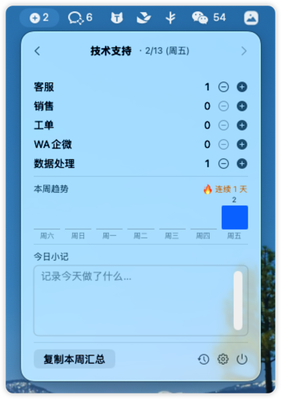
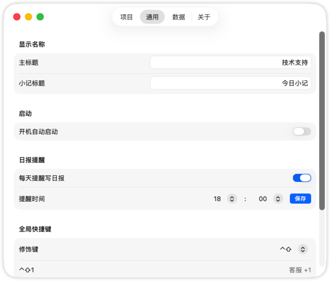

<div align="center">

# 🎯 TicTracker

**轻量级 macOS 菜单栏技术支持计数器**

快捷键一键记录 · 日报提醒 · AI 周报 · Jira 集成 · RSS 订阅

[](https://www.apple.com/macos/)
[](https://swift.org)
[](LICENSE)
[](https://github.com/chenglun11/TicTracker/releases)

<p>
  
  &nbsp;&nbsp;
  
</p>

</div>

---

## ✨ 功能亮点

### 📊 计数与记录
- 菜单栏常驻，点击或快捷键即时 +1
- 自定义项目分类，独立计数
- 每次 +1 自动记录时间戳，日报视图 hover 查看
- 日期切换，回看和编辑历史数据
- 每日小记，支持 Markdown 语法

### ⌨️ 快捷键
- 每个项目可录制独立快捷键组合（如 `⌃⇧1`、`⌘⌥A`）
- `修饰键 + 0` 呼出快速日报弹窗
- 从旧版全局修饰键自动迁移

### 📈 统计与趋势
- 本周趋势图 — 按项目堆叠彩色柱状图，点击查看明细
- 日期范围统计视图（Swift Charts）
- 连续打卡天数 🔥
- 一键复制周报汇总
- AI 周报生成 — 支持 Claude / OpenAI，自定义 Prompt，Markdown 富文本渲染

### 🔔 智能通知
| 通知类型 | 操作按钮 | 说明 |
|---------|---------|------|
| 日报提醒 | 打开日报 · 稍后提醒 | 每天定时提醒，稍后 15 分钟再次推送 |
| 每日摘要 | 复制周报 · 查看详情 | 日报提醒后 30 分钟推送今日统计 |
| RSS 新条目 | 打开链接 | 直接在浏览器打开对应 URL |

### 🔗 Jira Server/DC 集成
- 工单列表查看与搜索
- 工单计数（手动 +1 / -1）
- 状态流转（一键流转到下一状态）
- 自动映射规则 — 按字段关联到项目
- 流转自动计数（每天每工单仅一次）

### 📡 RSS 订阅
- 多源订阅，每个订阅源可独立配置轮询间隔
- 新条目桌面通知，支持直接打开链接
- 已读/收藏标记，左滑快速操作
- 全部/未读/收藏筛选器

### ⌨️ 快捷键视觉反馈
- 快捷键触发时按钮动画反馈（放大 + 颜色变化）
- 实时视觉确认，提升操作体验

### 🎛️ 功能模块开关
- 日报记录、趋势图、时间戳、快捷键、RSS 可独立启停
- 所有设置自动保存，凭证失焦即存入 Keychain

### 💾 数据管理
- 数据导出 / 导入（JSON、CSV）
- 开机自动启动
- 所有数据本地存储（`UserDefaults`）

---

## 🚀 快速开始

### 系统要求

- macOS 14.0+（Sonoma），macOS 15+ 体验更佳
- Swift 6.0+

### 构建与运行

```bash
# 编译并打包为 .app（release 编译 + ad-hoc 签名）
bash build.sh

# 启动
open TicTracker.app
```

---

## ⌨️ 快捷键参考

在「设置 → 通用 → 快捷键」中为每个项目录制快捷键：

| 操作 | 说明 |
|------|------|
| 点击录制框 → 按下组合键 | 为项目绑定快捷键 |
| ✕ 按钮 | 清除快捷键 |
| `修饰键 + 0` | 打开快速日报弹窗 |

> 快速日报的修饰键取自第一个已绑定项目。例如第一个项目绑了 `⌃⇧1`，则 `⌃⇧0` 打开日报。未绑定时默认 `⌃⇧0`。

---

## 📄 License

[MIT](LICENSE)

---

<div align="center">
  <sub>Made with ☕ by Max Li</sub>
</div>
