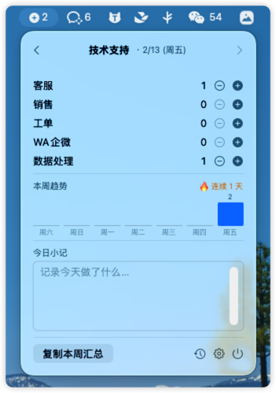
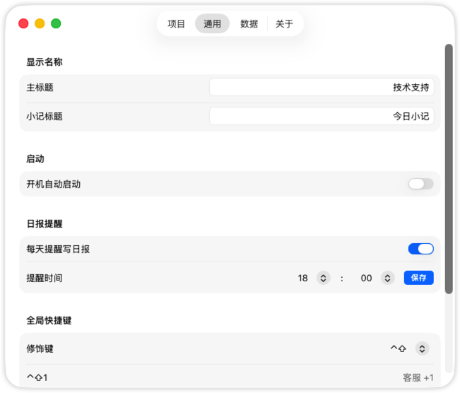

# TicTracker

TicTracker 是一个面向技术支持、产品运营和研发协作的 macOS 菜单栏工作台。它从“今天帮了哪些项目、处理了哪些问题”这个最小动作出发，把快捷计数、问题追踪、日报周报、AI 总结、Jira / Linear / 飞书 / RSS 集成放在一个轻量工具里。

项目当前包含三部分：

- **macOS 客户端**：SwiftUI 菜单栏应用，是主要使用入口。
- **同步服务端**：Go + SQLite，用于多端同步、Web 后台、飞书事件回调和定时推送。
- **Web / Tauri 前端**：React 工作台，用于浏览和管理同步后的团队问题流。




## 主要能力

### 日常支持记录

- 菜单栏常驻显示今日总数。
- 为不同项目配置独立计数项，一键或快捷键 `+1`。
- 自动记录点击时间戳，方便回看当天发生过什么。
- 支持每日小记，Markdown 内容会出现在最近日记和报表里。
- 最近日记按周归档，支持搜索、查看单日明细和复制报表。

### 问题追踪

- 统一管理 Bug、Feature、Support 三类问题。
- 支持待处理、处理中、测试中、已排期、观测中、已修复、已忽略等状态。
- 记录负责人、部门、Jira Key、Linear Key、提交人、标签和关注人。
- 可从 Jira、Linear、飞书任务等外部来源同步问题。
- 日报和报表会按有效问题活动生成摘要，不把普通评论当成 AI 报告的有效输入。

### 报表与 AI

- 一键复制技术支持周报。
- 支持本周、上周、本月、上月报表范围。
- AI 报告支持 Claude / OpenAI，配置项在「设置 → AI」。
- 月总结提供可视化详情页，可先查看每日明细、项目排行和问题列表，再复制文本、复制图片或导出 PNG。
- 可生成日报、周报、月报图片，用于飞书或手动分享。

### 集成能力

- **Jira**：拉取经办 / 提交工单，支持计数、搜索和状态流转。
- **Linear**：同步 Linear issue、项目和负责人信息。
- **飞书 Bot**：定时发送日报，支持消息卡片、富文本、自定义模板和图片报表。
- **飞书任务**：支持用户 OAuth 或应用身份同步任务。
- **RSS**：订阅多个来源，新条目通知、已读和收藏管理。
- **同步服务**：通过本地或自托管 Go 服务同步 macOS 客户端和 Web 后台数据。

## 系统要求

- macOS 14.0 或更高版本
- Swift 6.0
- Go 1.22（仅服务端需要）
- Node.js 18+（仅 Web / Tauri 前端需要）

## 快速开始

### 运行 macOS 客户端

```bash
swift build
swift run TicTracker
```

打包为 `.app` 并启动：

```bash
bash build.sh
```

脚本会执行 release 构建、组装 `TicTracker.app`、使用 ad-hoc 签名，然后自动打开应用。

### 运行同步服务端

```bash
cd server
go run .
```

默认监听 `127.0.0.1:9999`。健康检查：

```bash
curl http://127.0.0.1:9999/healthz
```

服务端配置文件为 `server/config.yaml`，可参考 `server/config.example.yaml`。更多部署、安全和接口说明见 [server/README.md](server/README.md)。

### 运行 Web 后台

```bash
cd web
npm install
npm run dev
```

构建 Web 静态资源：

```bash
cd web
npm run build
```

### 运行 Tauri 前端

根目录还包含一个 Tauri + Vite 原型：

```bash
npm install
npm run tauri:dev
```

## 常用命令

| 场景 | 命令 |
| --- | --- |
| Swift 调试构建 | `swift build` |
| Swift release 打包 | `bash build.sh` |
| 服务端启动 | `cd server && go run .` |
| 服务端测试 | `cd server && go test ./...` |
| 服务端静态检查 | `cd server && go vet ./...` |
| Web 开发 | `cd web && npm run dev` |
| Web 构建 | `cd web && npm run build` |
| Tauri 开发 | `npm run tauri:dev` |

## 配置入口

macOS 客户端的主要配置都在「设置」窗口：

- **项目**：维护项目分类和计数项。
- **通用**：提醒、启动项、快捷键和基础行为。
- **问题追踪**：问题状态、提交人、标签和工作台偏好。
- **Linear / Jira 入口**：外部工单系统接入。
- **飞书 Bot**：Webhook、定时发送、消息格式、任务同步和卡片模块。
- **AI**：Provider、模型、Base URL、Prompt 和开关。
- **数据**：导入、导出和本地数据管理。
- **同步**：连接自托管同步服务。

敏感凭证会尽量写入 Keychain；普通偏好和业务数据主要保存在本机用户数据区。

## 快捷键

每个项目都可以录制独立快捷键。常见用法：

- 点击录制框，然后按下组合键，例如 `Control + Shift + 1`。
- 点击清除按钮移除绑定。
- `修饰键 + 0` 会打开快速日报弹窗。

快速日报的修饰键来自第一个已绑定项目；如果尚未绑定项目快捷键，默认使用 `Control + Shift + 0`。

## 数据与同步

macOS 客户端默认本地存储，适合个人使用。需要团队协作或 Web 后台时，可以启用同步服务：

1. 在 `server/config.yaml` 中配置 `sync_token`、`web_token` 和数据目录。
2. 启动 `server`。
3. 在 macOS 客户端「设置 → 同步」中填入服务地址和 token。
4. 使用 Web 后台查看同步后的问题、日报和飞书发送状态。

服务端当前以 SQLite 为主存储。旧版 `sync.json` 会在首次启动时导入，并保留备份。

## 飞书与安全

如果只在本机使用，可以保持服务端默认 `127.0.0.1` 监听。若要开放到局域网或公网，请至少完成：

- 使用强随机值替换 `sync_token` 和 `web_token`。
- 收紧 `server/config.yaml` 和 `server/data/` 文件权限。
- 飞书事件回调启用 Verification Token、Encrypt Key 和签名校验。
- 公网访问建议放在 Caddy、Nginx 或 Cloudflare Tunnel 后面，并启用 HTTPS。

详细清单见 [server/README.md](server/README.md)。

## 目录结构

```text
.
├── Sources/          # SwiftUI macOS 菜单栏客户端
├── server/           # Go 同步服务、Web API、飞书回调和 SQLite 存储
├── web/              # React + Ant Design Web 后台
├── src/              # Tauri / Vite 前端原型
├── src-tauri/        # Tauri Rust 壳
├── image/            # README 截图资源
├── build.sh          # macOS .app 打包脚本
└── Package.swift     # Swift Package 配置
```

## 许可证

当前仓库未包含独立许可证文件。如需对外分发，请先补充 `LICENSE`。
